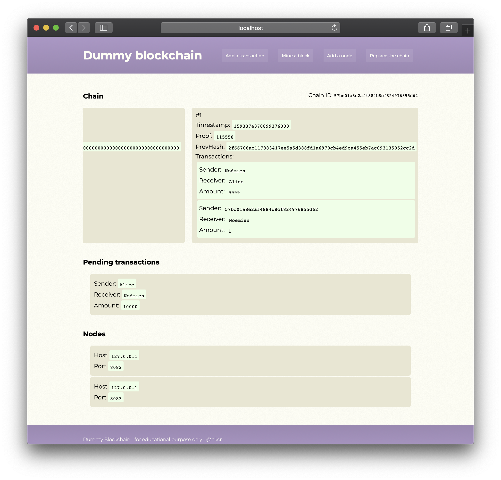

# dummy-blockchain

Simple Bitcoin-like blockchain for educational purpose

<div align="center">
    
</div> 

With `dummy-blockchain` you can get a feel on how the peer-to-peer Bitcoin protocol works by launching and interacting with multiple independent nodes.

A node can do the following:

- include a new transaction to its pending pool of transactions
- include its pending transactions to a new block by "mining" a new block that will be appended to the node's chain
- add a node to its list of known nodes
- check if a node from its list of know nodes has a longer chain and, if that's the case, replace its current chain by the longest one found
- check the validity of its chain

A node offers a user-friendly http interface and a REST api. Once the node is started, the http interface can be accessed at `localhost:8080`. This is also the root url for the REST api calls.

All the data are kept in-memory and destroyed once the node is shut down.

## Source code structure

```
blockchain/ <- the interesting stuff
docs/       <- some screenshots
gui/        <- the http frontend and REST handlers
mod.go      <- the http server setup and entrypoint
```

## Run

Each node is an http server. You can run as many as you want. The arguments are optional.

The owner indicates who the transaction fees earned by the node will be sent to.

```bash
go run mod.go -listen-addr :8081 -owner Alice
```

## REST API

**Get the chain**

```bash
GET /get_chain
```

**Mine a block**

```bash
GET /mine_block
```

**Check and replace chain if needed**

```bash
GET /replace_chain
```

**Check the chain validity**

```bash
GET /is_valid
```

**Add a node**

```bash
POST /add_node

# body application/json 
{
    "Nodes": [
        {
            "Host": "127.0.0.1",
            "Port": 8081
        },
        ...
    ]
}
```

**Add a transaction**

```bash
POST /add_transaction

# Body application/json
{
    "Sender": "Alice",
    "Receiver": "Bob",
    "Amount": 10
}
```

## Note

This code is adapted from the [Blockchain A-Z™: Learn How To Build Your First Blockchain](https://www.udemy.com/course/build-your-blockchain-az/) online course.